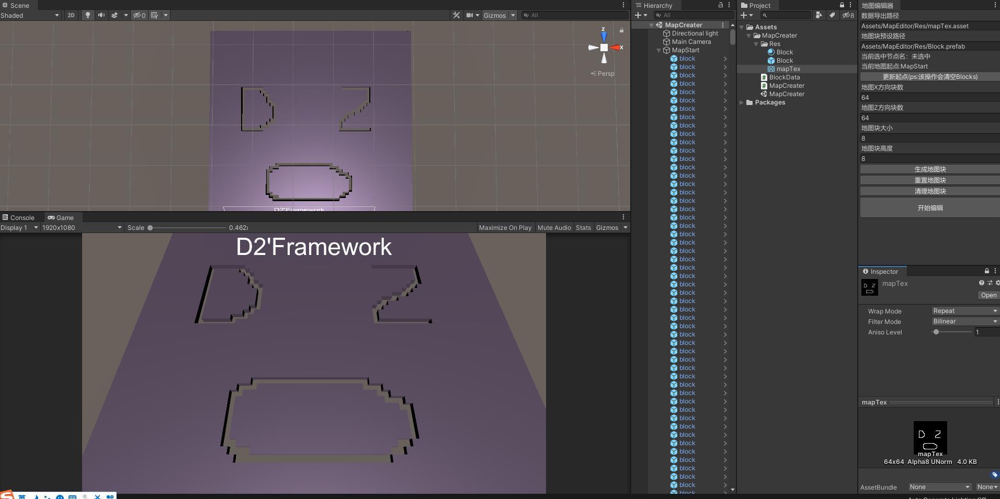

# D2Framework-ToolEditor
- D2Framework 之 编辑器工具（ToolEditor）

## 版本迭代日志

| 版本号                    | 迭代内容                                                     | 下载                                                         |
| ------------------------- | ------------------------------------------------------------ | ------------------------------------------------------------ |
| Version_0_0_0_1__20210417 | 【增加】搭建 github 工程库  【增加】创建 工程库的ReadMe.md  【增加】增加 地图编辑器工具 | [Download](https://github.com/xdreamboy2x/D2Framework-ToolEditor/releases/tag/0.0.0.1) |
|                           |                                                              |                                                              |
|                           |                                                              |                                                              |
|                           |                                                              |                                                              |

### `Version_0_0_0_1__20210417`

